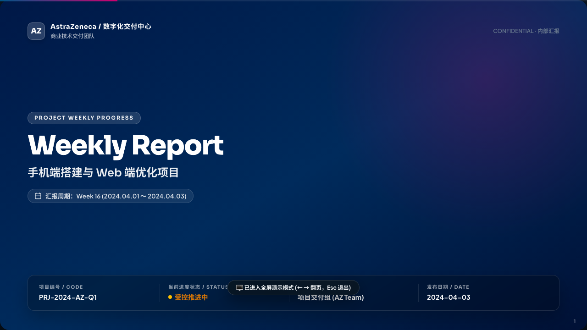
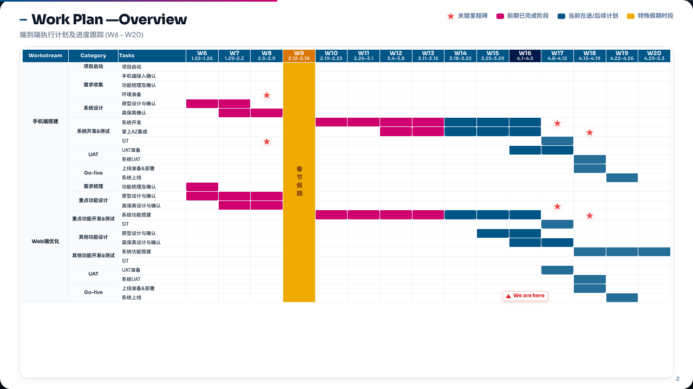
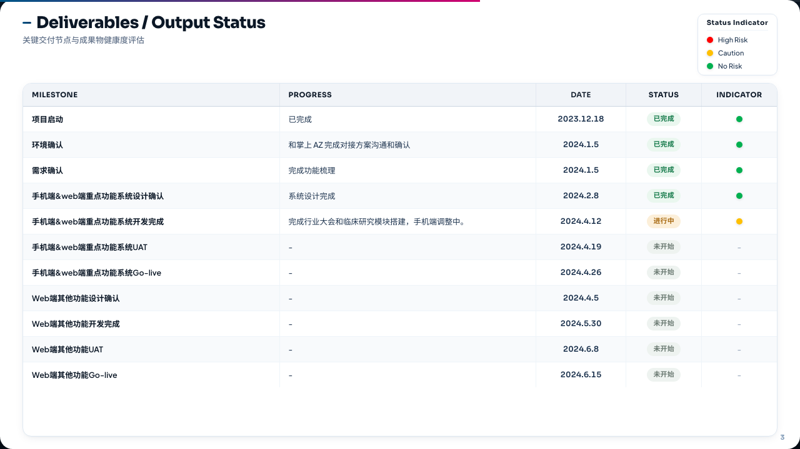
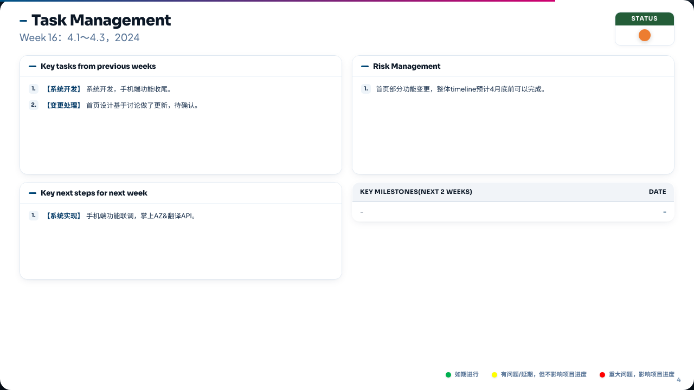

# Weekly Report Generator（企业高阶周报生成器）

> **通用 AI Agent 技能与独立命令行工具 (Universal AI Agent Skill & Standalone CLI Tool)**：基于结构化 JSON 自动生成高保真企业级 HTML 与 16:9 矢量 PDF 周报。1:1 复刻麦肯锡、埃森哲等顶级咨询及世界 500 强高管汇报 PPT 视觉与排版标准。

> ⚡ **零第三方依赖 (Zero External Dependencies)**：纯 Python 标准库驱动，无需任何 `pip install`，开箱即用。

---

## 🎨 视觉效果预览 (Visual Previews)

| Slide 1: 封面页 (Cover) | Slide 2: 甘特图总体计划 (Work Plan) |
| :---: | :---: |
|  |  |
| **Slide 3: 交付物健康度评估 (Deliverables)** | **Slide 4: 任务执行与两周里程碑 (Tasks)** |
|  |  |

---

## 🌟 核心特性

- **四页标准基础骨架 + 灵活扩展 Slide 5+ 方案研讨页**：
  1. **Slide 1 封面页 (Cover)**：企业 Branding、项目编码、周期、汇报人、机密等级与整体健康度徽章，搭配沉浸式深色渐变背景与微透毛玻璃元数据卡片。
  2. **Slide 2 项目总体计划 (Work Plan Overview)**：端到端甘特图、跨多周任务条带映射、`We are here` 当前周指示箭头、法定节假日金色高亮列、关键里程碑星标（★）。
  3. **Slide 3 交付物及状态 (Deliverables / Output Status)**：聚焦战略级主要交付物与核心里程碑门禁，红黄绿健康度指示灯与软胶囊状态徽标。
  4. **Slide 4 本周工作 (Task Management)**：微观战术执行，前期重点工作、下周工作计划、风险管理双列卡片 + 统一行高规范与彩色指示前缀。
  5. **Slide 5+ 方案研讨与议题扩展页 (Discussion & Proposal Slides)**：支持在周报后追加任意多页讨论页，提供 **方案比选 (`comparison`)**、**卡片矩阵 (`cards`)**、**议题深研 (`agenda`/`deep-dive`)**、**评估矩阵表格 (`table`)** 与 **自由 HTML (`custom`)** 等企业级布局，配备推荐徽标与底部周会决议卡片。
- **🎬 影院级演播动效与全屏无黑边演示模式 (Presentation Deck Mode)**：
  - **分层交错入场动画（Staggered Entrance）**：翻页时标题、副标题与卡片依次平滑升起，动效灵动专业。
  - **微胶囊动态分页点**：悬浮 HUD 自动适配页面总数，当前页展开为发光胶囊 Pill，支持点击任意圆点即时跳转。
  - **空闲 2.6s 自动隐匿**：演示时 HUD 智能淡出，无遮挡呈现 100% 页面内容；鼠标轻移或按键瞬间滑出唤醒。
  - **快捷键全面支持**：按 `P` 进入演示，按 `F` 全屏，`←` / `→` 或 `Space` 翻页，`Esc` 退出；鼠标点击左右两侧半屏直接切页。
  - **浮空 Toast 交互通知**：主题切换、模式切换、保存导出时提供柔和的毛玻璃气泡状态提示。
- **✏️ 所见即所得直接内容编辑 (WYSIWYG Inline Editing)**：
  - **细节改字零阻力**：无需 Agent 重新跑一遍技能生成，点击顶部 **「✏️ 编辑内容」**（或直接双击页面任意文字，或按 `E`）即可直接在网页上修改错别字、润色一句话或修改交付物状态。
  - **双向数据同步**：修改后的文字不仅即时更新 DOM，还会自动同步回填至嵌入的 JSON 数据状态中。
  - **一键另存与打印**：点击 **「💾 另存 HTML」** 可一键下载保存包含修改的完整 HTML；点击 **「导出 PDF / 打印」** 即刻输出最新矢量 PDF。
- **📅 周一至周五工作周严格约束与智能日期校验**：
  - 时间轴日期严格要求为周一至周五（Python `weekday() == 0` 到 `4`），杜绝大模型日期幻觉。
  - 内置自动校验机制，支持 `--check-dates`（校验）、`--fix-dates`（自动对齐纠正）与 `--strict-dates`（严格模式）。
- **🏷️ 全页面标题/副标题动态自适应**：
  - 支持自定义所有页面的大标题与副标题，未指定时自动根据实际周列表自适应计算周期区间（如 `(W1 - W8)`）。
- **🎨 客户定制 PPT 模板导入与背景自适应 (Custom PPTX Template Extraction)**：
  - **开箱即用支持客户母版**：很多客户要求周报必须沿用企业自有 PPT 模板。现在只需提供一个 `.pptx` 文件，系统即可全自动解构提取封面背景大图、内页底纹/波浪图、企业 Logo 与主题主色调。
  - **零第三方依赖 (Zero pip dependencies)**：完全基于 Python 内置标准库与浏览器原生 `DecompressionStream`，无需安装 `python-pptx` 或 `Pillow`。
  - **双通道支持**：
    - **CLI 命令行参数**：`--pptx "/path/to/customer_template.pptx"` 一键编译。
    - **网页端交互式导入**：在周报页面点击 **「🎨 导入 PPT 模板」**，直接选择本地 `.pptx` 即可瞬时在浏览器内解压、提取并换肤，点击「另存 HTML」永久固化。
  - **完美视读保障**：自动叠加企业级暗色渐变（封面）与毛玻璃透气背景（内容页），确保文字与甘特图拥有绝对清晰的对比度与高级质感。
- **🎨 7 大企业主题与自定义调色系统 (Theme System)**：
  - 内置 `astrazeneca`（阿斯利康深蓝与洋红）、`novartis`（诺华钴蓝与暖橙）、`bayer`（拜耳深蓝与生机绿）、`jnj`（强生红）、`novo-nordisk`（诺和诺德蓝）、`wukong-green`（极客翠绿）、`vercel-minimal`（Vercel 极简风）。
  - 支持通过 JSON `customTheme` 自定义颜色覆盖，网页端支持侧边栏抽屉实时换肤与即时 JSON 编辑渲染。
- **📄 16:9 矢量 PDF 导出**：
  - 严格 `@media print` 媒体查询，动画与过渡自动安全降级为零延迟矢量排版，一页幻灯片对应一页 PDF（无论 4 页还是 N 页），无溢出截断。

---

## 🚀 智能体安装与接入 (Agent Installation)

本技能遵循标准 Agent 技能规范，可接入任意主流 AI 编码智能体，亦可作为独立 CLI 命令行工具使用：

### 1. 项目工作区安装 (推荐)
```bash
# 在你的工程根目录下
mkdir -p .agents/skills
git submodule add https://github.com/lighters/agent-skills.git .agents/skills/agent-skills
# 或直接软链接技能
ln -s /path/to/agent-skills/skills/weekly-report-generator .agents/skills/weekly-report-generator
```

### 2. 用户全局技能安装
```bash
# 克隆仓库
git clone https://github.com/lighters/agent-skills.git ~/.agent-skills

# Claude Code
mkdir -p ~/.claude/skills && ln -s ~/.agent-skills/skills/weekly-report-generator ~/.claude/skills/weekly-report-generator

# Google Antigravity / Gemini CLI
mkdir -p ~/.gemini/antigravity-cli/skills && ln -s ~/.agent-skills/skills/weekly-report-generator ~/.gemini/antigravity-cli/skills/weekly-report-generator

# 通用 Agent 全局目录
mkdir -p ~/.agent/skills && ln -s ~/.agent-skills/skills/weekly-report-generator ~/.agent/skills/weekly-report-generator
```

---

## 💻 命令行快速上手 (CLI Usage)

```bash
cd skills/weekly-report-generator

# 1. 常规编译生成 HTML 周报
python3 scripts/generate_report.py \
  --data examples/sample_data.json \
  --theme astrazeneca \
  --output weekly-report.html

# 2. 导入客户 PPT 模板一键自适应背景与 Logo
python3 scripts/generate_report.py \
  --data examples/sample_data.json \
  --pptx "/path/to/customer_template.pptx" \
  --output weekly-report.html

# 3. 仅校验时间轴日期与节假日合法性
python3 scripts/generate_report.py --data examples/sample_data.json --check-dates

# 4. 自动纠正非标准日期为周一至周五并生成报告
python3 scripts/generate_report.py --data your_data.json --fix-dates --output weekly-report.html

# 5. 导出为高清 16:9 矢量 PDF 附件（依赖本地 Chrome/Edge 浏览器）
python3 scripts/export_pdf.py \
  --input weekly-report.html \
  --output weekly-report.pdf
```

---

## 📂 目录结构与关键文件

```text
skills/weekly-report-generator/
├── SKILL.md                          # 通用 Agent 技能描述与执行规范 (必读)
├── README.md                         # 技能概述与使用手册
├── scripts/
│   ├── generate_report.py            # 周报核心 HTML 编译引擎（支持日期校验与 PPT 模板绑定）
│   ├── pptx_extractor.py             # PPTX 母版底图、配色与 Logo 纯标准库提取器
│   └── export_pdf.py                 # 无头 Chrome 矢量 PDF 导出脚本
├── templates/
│   ├── weekly_report_template.html   # 高保真 PPT 响应式 HTML 模板（含动效、演示系统与 PPTX 导入）
│   └── theme-presets.json            # 7 套企业主题调色板配置
├── examples/
│   ├── sample_data.json              # 基础范例数据（包含多工作流、甘特条、节假日与研讨页）
│   ├── weekly-report.html            # 编译生成的示范周报
│   └── weekly-report.pdf             # 导出的示范矢量 PDF
└── references/
    ├── input_format_guide.md         # 周报 JSON 数据输入格式与甘特图排版详细指南
    └── data_schema.md                # JSON Schema 字段定义规范
```

---

## 📖 详细文档

- **Agent 技能指令与执行约束**：[`SKILL.md`](./SKILL.md)
- **JSON 输入格式与排版指南**：[`references/input_format_guide.md`](./references/input_format_guide.md)
- **Schema 字段说明**：[`references/data_schema.md`](./references/data_schema.md)
